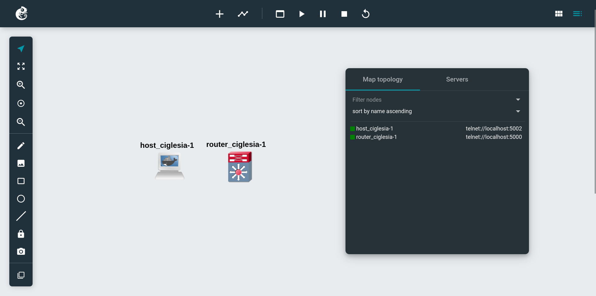
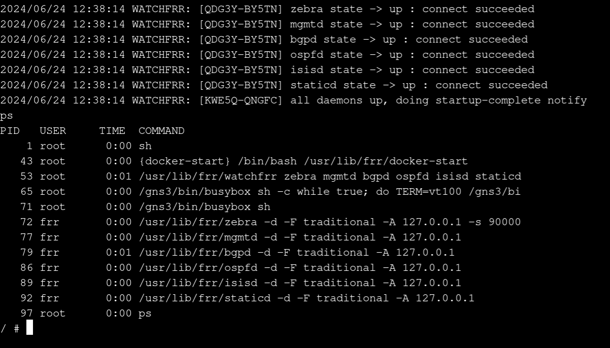

# P1 GNS3 Configuration with Docker

This part involves the configuration of **GNS3** (Network simulator) with Docker to create the hosts and routers using **Alpine Linux** and **FRRouting** (Routing software suite).

## GNS3

GNS3 is a **graphical network simulator** that allows users to design and test complex network topologies. In this project, we use GNS3 to configure and test our Docker images with the required routing services.

## FRRouting

FRRouting (FRR) is an **open-source routing software suite** that provides implementations of various network protocols. It is designed to manage and control routing within a network, enabling devices to communicate efficiently and reliably. FRR is widely used in both traditional and software-defined networking environments. FRR is a fork of Quagga, and Quagga is a fork of Zebra.

In this project, we use FRR to manage packet routing using the following services:

| **Service**                                                                 | **Description**                                                                                                                                                          |
|-----------------------------------------------------------------------------|--------------------------------------------------------------------------------------------------------------------------------------------------------------------------|
| Border Gateway Protocol Daemon (**BGPD**)                                   | It is responsible for establishing BGP sessions with other routers and exchanging routing information.                         |
| Open Shortest Path First Daemon (**OSPFD**)                                 | It is responsible for maintaining the OSPF link-state database and calculating the shortest path to each destination.        |
| Intermediate System to Intermediate System (**IS-IS**) Routing Engine Service | It maintains the IS-IS link-state database and calculates the shortest path to each destination. |

## Docker

The following Dockerfile can be used to create an FRR Docker image that runs BGPD, OSPFD, and IS-IS daemons along with BusyBox (Because it uses Alpine Linux as a base image, which uses BusyBox by default), which is required by GNS3:

```docker
FROM quay.io/frrouting/frr:9.1.0

ENV DAEMONS="zebra bgpd ospfd isisd"

# The watchfrr, zebra and staticd daemons are always started.
RUN sed -i -e "s/bgpd=no/bgpd=yes/g" /etc/frr/daemons && \
    sed -i -e "s/ospfd=no/ospfd=yes/g" /etc/frr/daemons && \
    sed -i -e "s/isisd=no/isisd=yes/g" /etc/frr/daemons && \
    sed -i '/^#frr_profile="traditional"/s/^#//' /etc/frr/daemons && \
    touch /etc/frr/vtysh.conf

ENTRYPOINT sh -c "/usr/lib/frr/docker-start & exec sh"
```

- **ENV DAEMONS**: Sets the environment variable DAEMONS to specify which daemons should be started (zebra, bgpd, ospfd, and isisd).
- **RUN Command**: The RUN command modifies the /etc/frr/daemons file to enable the BGP, OSPF, and IS-IS daemons. It also enables the traditional profile and ensures the vtysh.conf file exists.
- **ENTRYPOINT**: The entry point starts the FRR daemons and then launches a shell. The docker-start script initializes the FRR daemons, and exec sh ensures the container stays running.

## Project Diagram

The following diagram shows the two Docker containers configured in GNS3 as a host and a router:



This is the router's console, we can see that our daemons are running.




## Glossary

| Term                 | Definition                                                                                               |
|----------------------|----------------------------------------------------------------------------------------------------------|
| **Autonomous System (AS)** | A collection of IP networks and routers under the control of a single organization that presents a common routing policy to the internet. Identified by a unique ASN (Autonomous System Number). |
| **IGP (Interior Gateway Protocol)** | Protocol used for routing within an autonomous system. Examples include RIP, OSPF, and IS-IS. |
| **EGP (Exterior Gateway Protocol)** | Protocol used for routing between autonomous systems. The primary example is BGP. |
| **RIP (Routing Information Protocol)** | An older IGP that uses hop count as a routing metric, with a maximum of 15 hops. It periodically sends its entire routing table to all neighbors. |
| **OSPF (Open Shortest Path First)** | An IGP that uses link-state routing to maintain a map of the network and calculate the shortest path using Dijkstra's algorithm. |
| **IS-IS (Intermediate System to Intermediate System)** | A link-state routing protocol used within an AS to determine the best path for data using various metrics. |
| **BGP (Border Gateway Protocol)** | An EGP used to exchange routing information between autonomous systems. It uses TCP port 179 and supports route reflectors for reduced connections. |
| **BGP-EVPN (Ethernet VPN)** | An extension of BGP providing a control plane for VXLAN, advertising MAC and IP addresses between VXLAN Tunnel Endpoints (VTEPs). |
| **VXLAN (Virtual Extensible LAN)** | A network virtualization technology for scalable cloud computing deployments, encapsulating Ethernet frames within UDP packets. |
| **VNI (VXLAN Network Identifier)** | A 24-bit segment ID used to identify VXLAN segments, similar to VLAN IDs but with a larger address space. |
| **VTEP (VXLAN Tunnel Endpoint)** | Responsible for encapsulating and de-encapsulating packets into and out of VXLAN tunnels, mapping VNIs to MAC addresses. |
| **Zebra (protocol)** | Used by routing protocol daemons to communicate with the Zebra daemon, which manages routing information and installs routes in the kernel's forwarding table. |
| **Zebra (software)** | A routing software suite that included implementations of BGP, OSPF, RIP, and IS-IS. Now discontinued. |
| **Quagga** | A fork of Zebra that continued the development of the routing software suite, now also discontinued. |
| **FRRouting (FRR)** | A fork of Quagga that is an active project continuing the development and maintenance of the routing software suite, supporting various protocols. |
