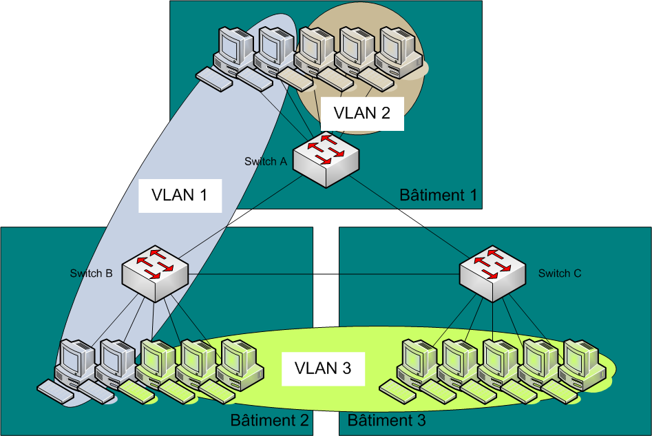
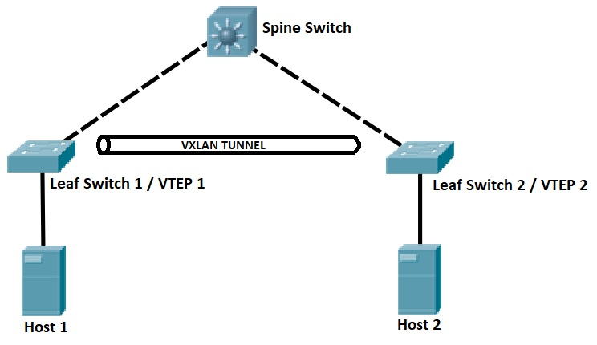
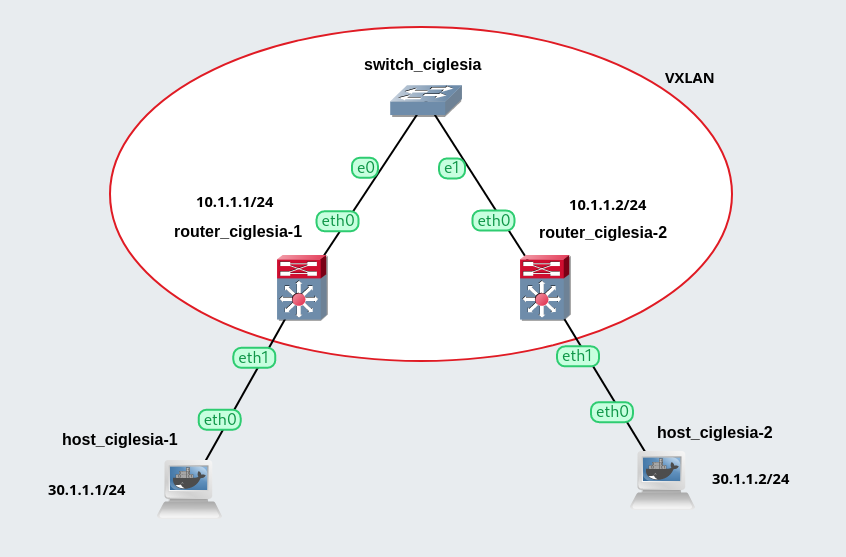
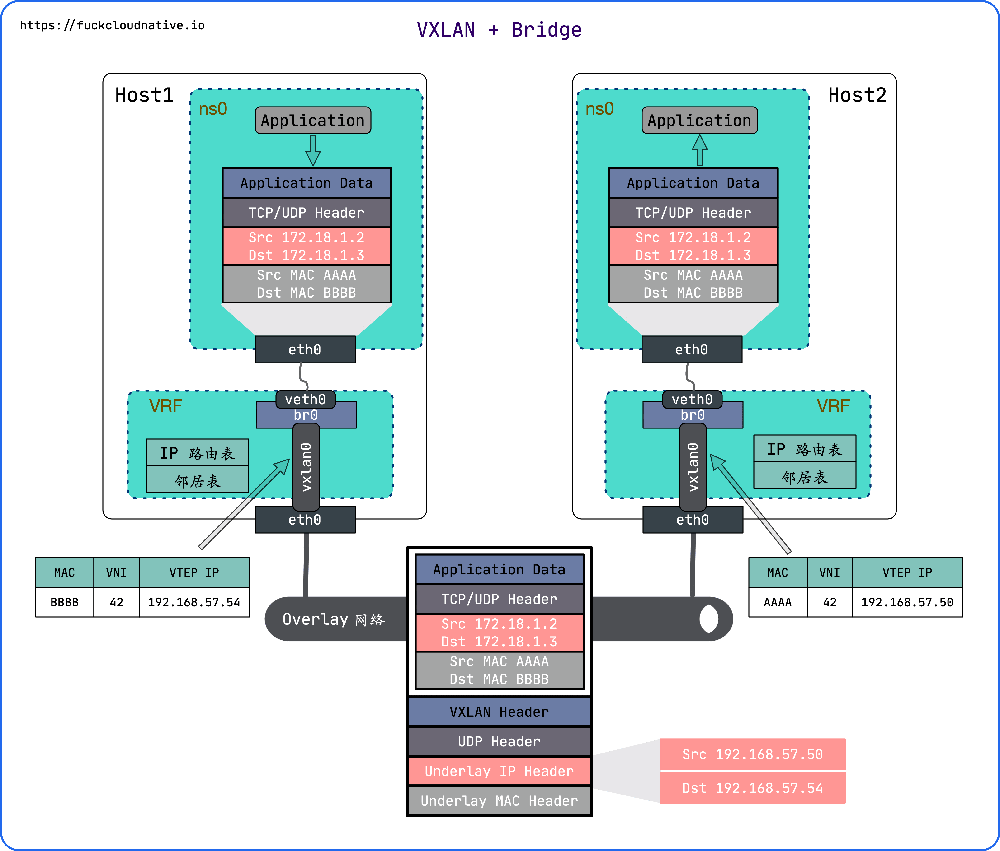
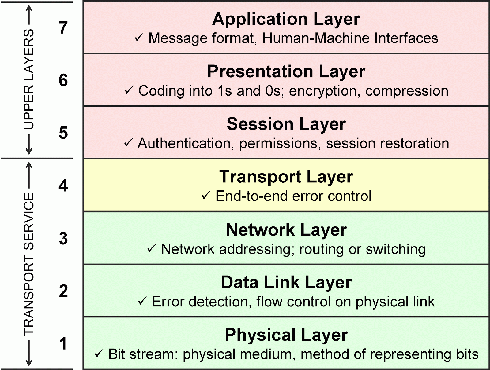

# P2 Discovering a VXLAN

## VXLAN

**VXLAN** (Virtual Extensible LAN) is a network virtualization technology that addresses the scalability limitations of traditional **VLANs** (Virtual LANs).



### How VXLAN Works

#### VXLAN Tunnel Endpoints (VTEPs)

VXLAN relies on **VXLAN Tunnel Endpoints** (VTEPs) for encapsulating and decapsulating Ethernet frames within UDP packets. 

**VTEPs** are responsible for the following:

- **Encapsulation:** When a VTEP receives a Layer 2 Ethernet frame destined for a VXLAN network, it encapsulates the frame into a VXLAN packet. This encapsulation process involves adding a VXLAN header (which includes the VNI) and a UDP header.

- **Decapsulation:** Upon receiving a VXLAN packet, the destination VTEP decapsulates the VXLAN packet to retrieve the original Layer 2 Ethernet frame and forwards it to the destination within the VXLAN segment.



#### Static (Peer-to-Peer) VXLAN Configuration

- **Point-to-Point Tunnels**: VXLAN tunnels are statically configured between specific VTEPs. Each VTEP is aware of the IP addresses of its peer VTEPs.

> [!NOTE]
> #### Configuration Example
> - VTEP A and VTEP B are configured with each other's IP addresses to establish a point-to-point VXLAN tunnel.
> - When VTEP A needs to communicate with a host on VTEP B's network, it encapsulates the Ethernet frame into a VXLAN packet with the destination VTEP B's VTEP IP address.
> - VTEP B receives the VXLAN packet, decapsulates it to retrieve the original Ethernet frame, and forwards it to the destination host.


#### Dynamic Multicast VXLAN Configuration

- **Multicast Group Address:** VXLAN uses multicast for efficient broadcast, unknown unicast, and multicast (BUM) traffic handling. Each VXLAN segment is associated with a multicast group address.

  <details>
  <summary><b>BUM</b></summary>

    | **Traffic Type**       | **General Networking**                                                                                                                                                     | **VXLAN Context**                                                                                                                                                           |
    |------------------------|----------------------------------------------------------------------------------------------------------------------------------------------------------------------------|----------------------------------------------------------------------------------------------------------------------------------------------------------------------------|
    | **Broadcast**          | Broadcast traffic is sent by a source to all devices within the same broadcast domain. Includes operations like ARP (Address Resolution Protocol) requests.              | In VXLAN, broadcast traffic is encapsulated into VXLAN packets and forwarded across the VXLAN network. Each VXLAN Tunnel Endpoint (VTEP) replicates the broadcast packet. |
    | **Unknown Unicast**    | Unknown unicast traffic is destined for a specific MAC address that the switch or router has not yet learned. The switch floods the frame to all ports in the VLAN.       | VXLAN treats unknown unicast traffic similarly to broadcast traffic by encapsulating it into VXLAN packets and forwarding them to all VTEPs in the VXLAN segment.          |
    | **Multicast**          | Multicast traffic is sent from one source to multiple recipients who have expressed interest in receiving the traffic. Uses multicast group addresses.                  | VXLAN uses IP multicast to efficiently handle multicast traffic within VXLAN segments, associating each segment with a multicast group address.                         |

  </details>

- **Dynamic Learning:** VTEPs dynamically learn the mappings of VXLAN segments to multicast group addresses.

> [!NOTE]
> #### Configuration Example
> - VTEPs dynamically join a multicast group associated with a VXLAN segment when they need to forward BUM traffic (such as broadcast or multicast traffic) within that segment.
> - When a VTEP receives BUM traffic from a locally connected host, it encapsulates the traffic into a VXLAN packet and sends it to the multicast group address associated with the destination VXLAN segment.
> - Other VTEPs that are part of the same VXLAN segment and have joined the multicast group receive the VXLAN packet, decapsulate it, and forward the traffic to the appropriate hosts within their segment.


## VLAN vs VXLAN

| Feature             | VLAN (Virtual Local Area Network)                          | VXLAN (Virtual Extensible Local Area Network)               |
|---------------------|------------------------------------------------------------|-------------------------------------------------------------|
| **Layer**           | Layer 2                                                    | Layer 2 over Layer 3                                        |
| **Encapsulation**   | 802.1Q tagging                                             | MAC-in-UDP encapsulation                                    |
| **ID Space**        | 12-bit VLAN ID (up to 4096 VLANs)                          | 24-bit VXLAN Network Identifier (up to 16 million VXLANs)   |
| **Scalability**     | Limited to 4096 VLANs per network                          | Scalable to 16 million VXLANs                               |
| **Broadcast Domain**| Limited to a single Layer 2 network segment                | Spans multiple Layer 3 network segments                     |
| **Deployment**      | Typically within a single data center                      | Can be deployed across multiple data centers                |
| **Use Case**        | Small to medium-sized networks                             | Large, complex, and multi-tenant networks                   |
| **Configuration**   | Relatively simple                                          | Requires more complex configuration                         |
| **Overhead**        | Minimal additional overhead                                | Additional overhead due to encapsulation                    |
| **Flexibility**     | Less flexible, bound by physical topology                  | More flexible, allows virtual networks over physical networks|
| **Isolation**       | Provides isolation at Layer 2                              | Provides isolation at both Layer 2 and Layer 3              |


### Virtual Network Identifier (VNI)

- **Definition:** VNI is a 24-bit identifier used in VXLAN to uniquely identify each virtual network (or segment) within the VXLAN overlay network. It plays a crucial role in encapsulating Layer 2 Ethernet frames in VXLAN tunnels across Layer 3 networks.

- **Purpose:** VXLAN (Virtual Extensible LAN) is a tunneling technology that allows the extension of Layer 2 segments over an underlying Layer 3 network. Each VXLAN segment, which corresponds to a virtual network, is identified by a VNI. This enables multiple virtual networks to coexist and be logically isolated from each other over the same physical infrastructure.

- **Format:** VNI is a 24-bit value, providing up to 16 million (2^24) unique VXLAN segments. The VNI is carried in the VXLAN header and is used by the VXLAN tunnel endpoints (VTEPs) to identify which virtual network (VXLAN segment) a specific Ethernet frame belongs to.

## VXLAN Configuration Guide

This guide walks you through the process of creating a basic VXLAN between two computers. VXLAN can be configured either statically using a peer-to-peer connection or dynamically using a multicast address.

> [!IMPORTANT]
> The commands must be ran inside their respective devices (Router and Host containers).

### Network Diagram

The current network diagram is as follows:



### IP Address Configuration

<details open>
<summary>To enable communication between the various network elements, assign valid IP addresses.</summary>

- ##### IP Assignation Command
    ```bash
    ip address add <ip_address>/<mask> dev <interface_name>
    ```

    ##### Router-1
    ```bash
    ip address add 10.1.1.1/24 dev eth0
    ```

    ##### Router-2
    ```bash
    ip address add 10.1.1.2/24 dev eth0
    ```
    ##### Host-1
    ```bash
    ip address add 30.1.1.1/24 dev eth0
    ```

    ##### Host-2
    ```bash
    ip address add 30.1.1.2/24 dev eth0
    ```

</details>

> [!IMPORTANT]
> The IP assignation is the only configuration needed for the hosts.

### VXLAN Configuration

The VXLAN configurations are for the routers only.

#### Peer-to-Peer Configuration

  For a peer-to-peer configuration, specify the IP address of the other VTEP in each VTEP:
  ```bash
  ip link add name <name> type vxlan id <vni> remote <destination_ip> dstport <destination_port> dev <device>
  ```

#### Multicast Configuration

  For a multicast configuration, specify the multicast IP address:
  ```bash
  ip link add name <name> type vxlan id <vni> group <multicast_ip> dstport <destination_port> dev <device>
  ```

  <details open>
  <summary> <b> Command Parameters breakdown </b> </summary>

  - `ip`: Command to manage the network device
  - `link`: Subcommand to manage the network device
  - `id <ID>`: Specifies the VXLAN Network Identifier (VNI)
  - `local <IPADDR>`: (Optional) Source IP address for outgoing packets
  - `remote <IPADDR>`: Remote VXLAN tunnel endpoint IP address for outgoing packets
  - `group <IPADDR>`: Multicast IP address to join (cannot be specified with `remote` and is required for multicast)
  - `dstport <PORT>`: UDP destination port (standard for VXLAN is 4789)
  - `dev <NAME>`: Physical device for tunnel endpoint communication
  - `-4`: (Optional) Specifies IPv4
  - `ttl <TTL>`: (Optional) Time to Live for outgoing packets

  </details>

### Bridge Configuration

A bridge connects the VXLAN (`vxlan10`) to the physical network device / ethernet interface (`eth1`).



```bash
ip link add name br0 type bridge  # Create the bridge
ip link set br0 up                # Start the bridge
ip link set vxlan10 up            # Start the VXLAN
ip link set vxlan10 master br0    # Connect VXLAN to the bridge
ip link set eth1 master br0       # Connect physical device to the bridge
```

<details>
<summary><b><i>brctl</i> alternative commands</b></summary>

, use the `brctl` command:
```bash
brctl addbr br0                  # Create the bridge
brctl addif br0 vxlan10          # Connect VXLAN to the bridge
brctl addif br0 eth1             # Connect physical device to the bridge
```
</details>

#### Role of the bridge (`br0`)

- **Layer 2 Connectivity:**

    - The bridge (br0) operates at Layer 2 (Data Link Layer) of the OSI model, forwarding Ethernet frames between its connected interfaces based on MAC addresses.

- **Integration of VXLAN and Physical Network:**

    - By connecting both vxlan10 and eth1 to the bridge br0, devices on the VXLAN segment can communicate with devices on the local physical network as if they were on the same local network segment.

- **MAC Address Learning and Forwarding:**

    - The bridge learns the MAC addresses of devices connected to its interfaces and maintains a forwarding table. This allows it to efficiently forward frames only to the destination interface, reducing unnecessary traffic.

- **Seamless Network Extension:**

    - The bridge enables seamless extension of the local network into the VXLAN segment. For example, a device connected to eth1 can send traffic to a device on the VXLAN network via `vxlan10`, and vice versa, without needing additional routing configurations.

### Static VXLAN Configuration

Static VXLAN configuration is a method where each VTEP is manually configured with the IP address of the remote VTEP. This approach establishes a direct peer-to-peer connection between VTEPs, ensuring that VXLAN packets are sent directly to the specified remote VTEP.

**Comparison with Dynamic/Multicast Configuration:** Static VXLAN configuration is simpler and more straightforward for small, stable networks where VTEP addresses do not change frequently. However, it can become cumbersome to manage as the network grows or when VTEP addresses change, requiring manual reconfiguration.

<details>
<summary> <b> VTEP config </b> </summary>

#### Router-1 (VTEP)
```bash
ip link add name vxlan10 type vxlan id 10 remote 10.1.1.2 dstport 4789 dev eth0
ip link add name br0 type bridge
ip link set br0 up
ip link set vxlan10 up
ip link set vxlan10 master br0
ip link set eth1 master br0
```

#### Router-2 (VTEP)
```bash
ip link add name vxlan10 type vxlan id 10 remote 10.1.1.1 dstport 4789 dev eth0
ip link add name br0 type bridge
ip link set br0 up
ip link set vxlan10 up
ip link set vxlan10 master br0
ip link set eth1 master br0
```

</details>

### Dynamic/Multicast VXLAN Configuration

Dynamic or multicast VXLAN configuration uses multicast groups to dynamically discover and communicate with VTEPs. In this setup, VTEPs join a multicast group and send packets to the multicast address. All VTEPs in the group receive the packets, which helps in scenarios with multiple VTEPs without the need for manual configuration of each remote VTEP.

The goal of multicast is to send packets to all devices in the network. A multicast group is a group of devices that listen to a specific IP address. When a device sends a packet to the multicast IP address, all devices in the multicast group receive the packet.

To improve performance and limit the number of multicasts on the network, each VTEP creates a table of correspondences between MAC addresses and VTEP IP addresses. This table can be displayed with:
```bash
bridge fdb show dev vxlan10
# Or watch the changes
watch bridge fdb show dev vxlan10
```

**Comparison with Static VXLAN Configuration:** Dynamic/multicast VXLAN configuration is more scalable and flexible, making it suitable for larger, dynamic networks where VTEPs might be added or removed frequently. It reduces the administrative overhead of manually updating VTEP addresses but can introduce complexity in managing multicast groups and ensuring proper network performance.

<details>
<summary> <b> VTEP config </b> </summary>

#### Router-1 (VTEP)
```bash
ip link add name vxlan10 type vxlan id 10 group 239.1.1.1 dstport 4789 dev eth0
ip link add name br0 type bridge
ip link set br0 up
ip link set vxlan10 up
ip link set vxlan10 master br0
ip link set eth1 master br0
```

#### Router-2 (VTEP)
```bash
ip link add name vxlan10 type vxlan id 10 group 239.1.1.1 dstport 4789 dev eth0
ip link add name br0 type bridge
ip link set br0 up
ip link set vxlan10 up
ip link set vxlan10 master br0
ip link set eth1 master br0
```

</details>

### Connection tests

From the terminal of any router, we can capture the comunication (`ping`) between the hosts this way.
```bash
tshark -i vxlan10 'icmp' # 'icmp && !icmp6'
```

---

## Glossary




| Term                | Definition |
|---------------------|------------|
| **VLAN**            | Virtual Local Area Network, a method of segmenting a single physical network into multiple logical networks at the data link layer (Layer 2). VLANs improve network efficiency, security, and management by isolating traffic between different segments while appearing as separate networks despite sharing the same physical infrastructure. |
| **VXLAN**           | Virtual Extensible LAN, a technology that extends Layer 2 networks over Layer 3 networks using UDP encapsulation. VXLAN enables the creation of virtualized network segments that are scalable across large, multi-tenant data center environments.  |
| **VTEP**            | Virtual Tunnel Endpoint, a logical entity that acts as a termination point for VXLAN tunnels. VTEPs are responsible for encapsulating and decapsulating VXLAN packets and forwarding them to the appropriate destination. |
| **Peer-to-peer**    | A type of VXLAN configuration where each VTEP is configured to send traffic directly to the other VTEP. In this configuration, the VTEPs are configured with the IP address of the other VTEP as the destination for all VXLAN traffic. |
| **Multicast**       | A type of VXLAN configuration where VTEPs use a multicast address to communicate with each other. In this configuration, VTEPs send multicast messages to all other VTEPs present on the multicast group when they receive a packet with an unknown destination MAC address. |
| **Router**          | A networking device that forwards data packets between computer networks. Routers connect two or more networks and route packets based on their IP address. |
| **Switch**          | A networking device that connects devices together on a computer network by using packet switching to receive, process, and forward data to the destination device. Switches operate at the data link layer (Layer 2) of the OSI model. |
| **Host**            | A computer or other device connected to a computer network. Hosts can communicate with each other over the network by exchanging data packets. |
| **Link**            | A communication channel between two devices. In networking, a link refers to the physical or logical connection between two devices. |
| **IP address**      | A unique identifier assigned to each device on a computer network. IP addresses are used to route data packets between devices on the network. |
| **Subnet**          | A logical subdivision of an IP network. Subnets are used to divide a larger network into smaller, more manageable segments. |
| **MAC address**     | A unique identifier assigned to a network interface controller (NIC) for use as a network address in communications within a network segment. MAC addresses are used to identify devices on a LAN. |
| **UDP**             | User Datagram Protocol, a connectionless transport protocol used for sending datagrams over IP networks. UDP is used as the transport protocol for VXLAN encapsulation. |
| **TTL**             | Time to Live, a value that indicates how long a packet should remain in the network before being discarded. The TTL value is set by the sender of the packet and is decremented by each router that forwards the packet. If the TTL value reaches zero, the packet is discarded. |
| **BGP**             | Border Gateway Protocol, the protocol used to exchange routing information between autonomous systems on the Internet. BGP makes decisions based on paths, network policies, and rulesets configured by a network administrator. |
| **Autonomous System (AS)** | A collection of IP networks and routers under the control of a single organization that presents a common routing policy to the Internet. |
| **Border Gateway**  | The gateway that connects an autonomous system with other autonomous systems. It uses BGP to exchange routing information with the border gateways of other autonomous systems. |
