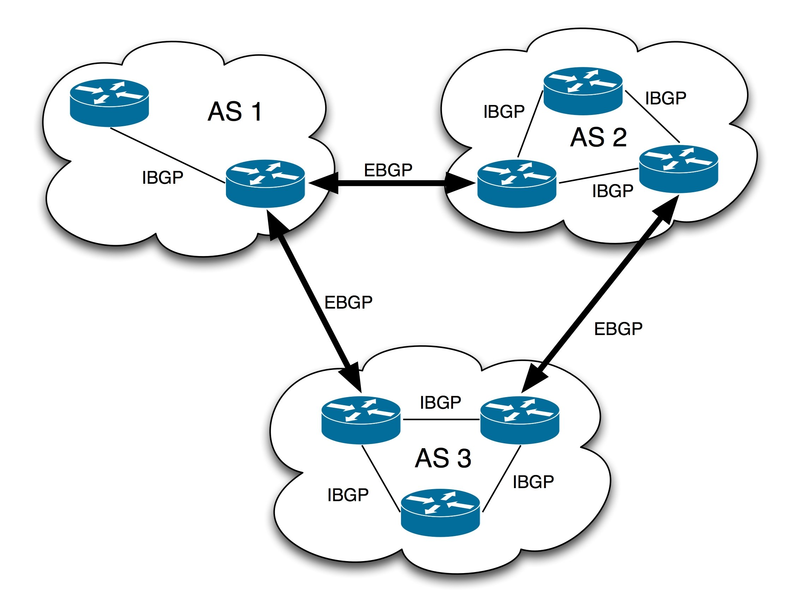
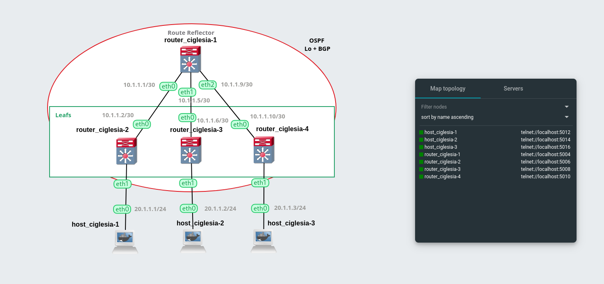

# P3 BGP-EVPN Spine-and-Leaf Architecture

## BGP

Border Gateway Protocol (**BGP**) is a standardized exterior gateway protocol (**EGP**) designed to exchange routing information between different autonomous systems (**ASes**) on the internet.



- **Exterior Gateway Protocol (EGP):** Protocol to exchange routing information between different Autonomous Systems. It helps ensure data can be routed across the global internet.
- **Autonomous System (AS):** A large network or group of networks under a single organization's control that presents a unified routing policy to the internet. Each AS is assigned a unique AS number (**ASN**).
- **BGP Peers/Neighbors:**
  - BGP routers establish peer relationships with routers in other ASes (external BGP, eBGP) or within the same AS (internal BGP, iBGP).
  - Peers exchange routing information to propagate route knowledge.
- **Path Vector Protocol:**
  - BGP uses a path vector mechanism to maintain the path information that gets updated dynamically as routes change.
  - Each BGP route advertisement includes the full path of ASes that the route traverses.
- **Route Advertisement and Selection:**
  - BGP routers advertise routes to their peers, including various attributes like AS path, next-hop, and multiple others.
  - BGP uses these attributes to select the best path when multiple routes to the same destination exist.
- **Policy-Based Routing:** BGP allows for complex routing policies based on multiple attributes, making it highly flexible for network administrators to control route selection and traffic flow.

### Type 2 and 3 Routes

| Feature                  | Type 2 Route                                        | Type 3 Route                                      |
|--------------------------|-----------------------------------------------------|---------------------------------------------------|
| **Layer of Connectivity**| Layer 2 (MAC address reachability)                  | Layer 3 (IP address reachability)                 |
| **Usage**                | Used in Layer 2 VPN services (BGP/MPLS VPN, EVPN)   | Used in general IP routing (Internet, enterprise networks) |
| **Attributes**           | - MAC address<br>- VNI (in VXLAN deployments)<br>- Other Layer 2 specific parameters | - IP prefix<br>- Subnet mask<br>- Next-hop IP address<br>- AS path<br>- Other BGP attributes for IP routing |
| **Typical Deployment**   | Data centers, multi-tenant environments             | Internet service providers, enterprise networks   |
| **Example Scenario**     | - Extending Layer 2 networks across Layer 3 boundaries<br>- Providing VLAN-like services over WAN<br>- Multi-tenant environments | - Advertising IP prefixes to enable end-to-end connectivity<br>- Optimizing paths across AS boundaries          |

### Explanation:
- **Layer of Connectivity**: Type 2 routes deal with Layer 2 MAC addresses and VXLAN-specific identifiers (VNI), facilitating connectivity at the data link layer. Type 3 routes, on the other hand, focus on IP address reachability, enabling network layer connectivity across diverse networks.
  
- **Usage**: Type 2 routes are crucial for VPN services that require virtualized Layer 2 connectivity, such as BGP/MPLS VPNs and Ethernet VPNs (EVPN). Type 3 routes are foundational in Internet routing and enterprise networks for IP address management and routing.
  
- **Attributes**: Type 2 routes carry MAC addresses, VNIs in VXLAN, and specific Layer 2 parameters. Type 3 routes include IP prefixes, subnet masks, next-hop addresses, AS paths, and other BGP attributes essential for IP routing decisions.

- **Typical Deployment**: Type 2 routes are commonly deployed in data centers and multi-tenant environments where virtualized Layer 2 networks are needed. Type 3 routes are used extensively by ISPs and large enterprises to manage IP routing across global networks.

- **Example Scenario**: Type 2 routes facilitate extending Layer 2 networks over Layer 3 infrastructure, providing VLAN-like services across WANs and supporting multi-tenancy scenarios. Type 3 routes enable ISPs to advertise IP prefixes for efficient routing across the Internet and within enterprise networks.

## EVPN

EVPN (Ethernet VPN) is a technology designed to address the limitations of traditional VXLAN deployments by providing a scalable and efficient control plane, using MP-BGP (Multiprotocol BGP), for network virtualization overlays.

This allows for automated VXLAN tunnel establishment and efficient exchange of network reachability information, including Layer 2 MAC addresses and Layer 3 routing information.

## BGP-EVPN Protocol

BGP-EVPN (Border Gateway Protocol - Ethernet Virtual Private Network) is an extension to BGP that enhances its functionality to support Layer 2 VPN services over an IP/MPLS (Multiprotocol Label Switching) network. It enables the advertisement of MAC addresses, IP addresses, and other Layer 2 and Layer 3 reachability information using BGP.

### Relationship with VXLAN and BGP:

- **VXLAN:** VXLAN itself provides the data plane encapsulation for creating overlay networks over an existing Layer 3 infrastructure. It extends Layer 2 segments across Layer 3 boundaries.

- **BGP:** MP-BGP, in the context of EVPN, serves as the control plane protocol for VXLAN networks. It facilitates the exchange of MAC address and routing information between VTEPs, enabling automatic tunnel establishment and efficient network operation.

| Advantages of EVPN in VXLAN                             | Description                                                                                         |
|---------------------------------------------------------|-----------------------------------------------------------------------------------------------------|
| Automatic VTEP Discovery                                 | VTEPs (VXLAN Tunnel Endpoints) can be dynamically discovered through BGP, simplifying network deployment and scalability.                                          |
| Reduced Flooding Traffic                                | Unlike traditional VXLAN deployments where MAC addresses are learned through flooding (data plane), EVPN uses BGP to propagate this information (control plane), reducing unnecessary traffic and improving network efficiency. |
| Support for Layer 2 and Layer 3                         | EVPN supports both Layer 2 MAC address learning and Layer 3 IP routing information within the same overlay network, making it versatile for various network architectures.                                                                                                            |

## OSPF

**OSPF** (Open Shortest Path First) is a routing protocol used within larger autonomous systems (ASes) or networks to efficiently exchange routing information and compute the best paths for routing IP packets. It operates within the Internet Protocol Suite's Internet Layer (Layer 3) and is categorized as an Interior Gateway Protocol (IGP), meaning it is used for routing within a single autonomous system.

An IGP that uses link-state routing to maintain a map of the network and calculate the shortest path using **Dijkstra's algorithm**.

### Key Components

| Component           | Description                                                                                   |
|---------------------|-----------------------------------------------------------------------------------------------|
| **Spine**           | The central router (route reflector) that connects to all leaf routers, distributing routes.  |
| **Leaf**            | Edge routers (VTEPs) that connect to spines and end hosts.                                    |
| **VTEP**            | VXLAN Tunnel Endpoint, a device that encapsulates and decapsulates VXLAN packets.             |
| **Route Reflector** | A router that distributes BGP routes to its clients, reducing the need for full mesh connectivity. |
| **VXLAN**           | Virtual Extensible LAN, a tunneling protocol to extend Layer 2 networks over a Layer 3 network. |
| **EVPN**            | Ethernet VPN, an extension to BGP that provides Layer 2 and Layer 3 VPN services.             |

### BGP-EVPN Operation

1. **Route Distribution**: The route reflector (spine) distributes MAC and IP routes between leaf routers (VTEPs).
2. **VXLAN Tunnels**: VXLAN tunnels are established between VTEPs to encapsulate Layer 2 frames within Layer 3 packets.
3. **Control Plane**: BGP is used as the control plane protocol to exchange MAC and IP address mappings between VTEPs.
4. **Data Plane**: VXLAN is used as the data plane protocol to carry encapsulated Layer 2 frames over the Layer 3 network.

### Glossary

| Term                  | Description                                                                 |
|-----------------------|-----------------------------------------------------------------------------|
| **BGP**               | Border Gateway Protocol, used for exchanging routing information.           |
| **EVPN**              | Ethernet Virtual Private Network, an extension to BGP for Layer 2 and 3 VPNs. |
| **VTEP**              | VXLAN Tunnel Endpoint, responsible for encapsulating and decapsulating VXLAN packets. |
| **VXLAN**             | Virtual Extensible LAN, a tunneling protocol for extending Layer 2 networks over Layer 3. |
| **MAC Address**       | Media Access Control address, a unique identifier for network interfaces.   |
| **IP Address**        | Internet Protocol address, a unique identifier for devices on a network.    |
| **Route Reflector**   | A router that distributes BGP routes to other routers to reduce full mesh connectivity. |
| **ASN**               | Autonomous System Number, a unique identifier for a collection of IP networks. |
| **OSPF**              | Open Shortest Path First, a routing protocol for IP networks.               |
| **Spine-Leaf**        | A network topology with a central spine layer connected to multiple leaf nodes. |

## Network Diagram

The network topology for this project:



This project uses a "spine-and-leaf" architecture, popular in data centers for its efficiency and scalability.

- **One main router** acting as a route reflector (spine): This central router will manage and distribute routing information to all connected leaf routers.
- **Three sub-routers** acting as leafs (VTEPs): These leaf routers will connect to the spine and each other, forming the edges of the network where hosts connect.
- **Three hosts**: Each host will be connected to a different leaf router.

### BGP Route Reflection

Route reflection is a method that allows a route reflector (RR) to reflect BGP routes to its clients without requiring full mesh connectivity among all routers in the network. In a typical BGP setup, all routers would need to peer with each other directly (full mesh) to exchange routing information. This can become impractical and inefficient in large networks.

In a spine-and-leaf architecture, route reflection is configured on the spine routers (route reflectors). These routers manage the distribution of BGP routes, including EVPN routes, to leaf routers (VTEPs). This setup ensures efficient communication and optimal routing across your network topology.


### Benefits of Spine-and-Leaf Architecture

1. **Systematic Connectivity**: Each spine router connects to every leaf router, ensuring consistent and predictable connectivity.
2. **Scalability**: Additional spine and leaf routers can be added to expand the network without major reconfiguration.
3. **Redundancy**: Multiple spines can provide failover and load balancing, enhancing network reliability.
4. **Low Latency**: Any leaf can communicate with any other leaf with just one hop through the spine, ensuring minimal latency.

Example of a spine-and-leaf architecture:


## Setup

### Router-1 (Route Reflector)

The route reflector uses the BGP-EVPN protocol to efficiently share information (MAC mapping table / IP VTEPs) between the VTEPs.

#### Configuration Steps:

1. **Access Configuration Mode**: Use `vtysh` to enter configuration mode.
2. **Disable IPv6**: Disable IPv6 forwarding as it's not required for this project.
3. **Configure Interfaces**: Assign IP addresses to the interfaces (eth0, eth1, eth2, and the loopback interface).
4. **Set Hostname**: Assign a hostname to the router.
5. **Configure BGP**: Set up BGP within ASN 1, create a peer group for iBGP neighbors, and configure the route reflector client settings.
6. **Configure OSPF**: Enable OSPF for IP routing.

```bash
vtysh
configure terminal

hostname router_ciglesia-1
no ipv6 forwarding

interface eth0
    ip address 10.1.1.1/30
!
interface eth1
    ip address 10.1.1.5/30
!
interface eth2
    ip address 10.1.1.9/30
!
interface lo
    ip address 1.1.1.1/32
!

router bgp 1
    neighbor ibgp peer-group
    neighbor ibgp remote-as 1
    neighbor ibgp update-source lo
    bgp listen range 1.1.1.0/29 peer-group ibgp
    !
    address-family l2vpn evpn
        neighbor ibgp activate
        neighbor ibgp route-reflector-client
    exit-address-family
!
router ospf
    network 0.0.0.0/0 area 0
!
line vty
!
```

### Router-2 (Leaf 1)

#### Configuration Steps:

1. **Create Bridge and VXLAN Interface**: Set up the bridge interface and the VXLAN interface.
2. **Access Configuration Mode**: Use `vtysh` to enter configuration mode.
3. **Disable IPv6**: Disable IPv6 forwarding.
4. **Configure Interfaces**: Assign IP addresses to the interfaces (eth0 and the loopback interface).
5. **Set Hostname**: Assign a hostname to the router.
6. **Configure BGP**: Set up BGP within ASN 1, configure the route reflector client, and enable EVPN.
7. **Configure OSPF**: Enable OSPF for IP routing.

```bash
ip link add br0 type bridge
ip link set dev br0 up
ip link add vxlan10 type vxlan id 10 dstport 4789
ip link set dev vxlan10 up
brctl addif br0 vxlan10
brctl addif br0 eth1

vtysh
configure terminal

hostname router_ciglesia-2
no ipv6 forwarding
!
interface eth0
    ip address 10.1.1.2/30
    ip ospf area 0
!
interface lo
    ip address 1.1.1.2/32
    ip ospf area 0
!

router bgp 1
    neighbor 1.1.1.1 remote-as 1
    neighbor 1.1.1.1 update-source lo
    !
    address-family l2vpn evpn
        neighbor 1.1.1.1 activate
        advertise-all-vni
    exit-address-family
!

router ospf
!
```

### Router-3 (Leaf 2)

This router is not added to the VXLAN for demonstration purposes.

#### Configuration Steps:

1. **Access Configuration Mode**: Use `vtysh` to enter configuration mode.
2. **Disable IPv6**: Disable IPv6 forwarding.
3. **Configure Interfaces**: Assign IP addresses to the interfaces (eth0 and the loopback interface).
4. **Set Hostname**: Assign a hostname to the router.
5. **Configure BGP**: Set up BGP within ASN 1 and configure the route reflector client settings.
6. **Configure OSPF**: Enable OSPF for IP routing.

```bash
vtysh
configure terminal

hostname router_ciglesia-3
no ipv6 forwarding
!
interface eth0
    ip address 10.1.1.6/30
    ip ospf area 0
!
interface lo
    ip address 1.1.1.3/32
    ip ospf area 0
!
router bgp 1
    neighbor 1.1.1.1 remote-as 1
    neighbor 1.1.1.1 update-source lo
    !
    address-family l2vpn evpn
        neighbor 1.1.1.1 activate
    exit-address-family
!
router ospf
!
```

### Router-4 (Leaf 3)

#### Configuration Steps:

1. **Create Bridge and VXLAN Interface**: Set up the bridge interface and

 the VXLAN interface.
2. **Access Configuration Mode**: Use `vtysh` to enter configuration mode.
3. **Disable IPv6**: Disable IPv6 forwarding.
4. **Configure Interfaces**: Assign IP addresses to the interfaces (eth0 and the loopback interface).
5. **Set Hostname**: Assign a hostname to the router.
6. **Configure BGP**: Set up BGP within ASN 1, configure the route reflector client, and enable EVPN.
7. **Configure OSPF**: Enable OSPF for IP routing.

```bash
ip link add br0 type bridge
ip link set dev br0 up
ip link add vxlan10 type vxlan id 10 dstport 4789
ip link set dev vxlan10 up
brctl addif br0 vxlan10
brctl addif br0 eth1

vtysh
configure terminal

hostname router_ciglesia-4
no ipv6 forwarding
!
interface eth0
    ip address 10.1.1.10/30
    ip ospf area 0
!
interface lo
    ip address 1.1.1.4/32
    ip ospf area 0
!
router bgp 1
    neighbor 1.1.1.1 remote-as 1
    neighbor 1.1.1.1 update-source lo
    !
    address-family l2vpn evpn
        neighbor 1.1.1.1 activate
        advertise-all-vni
    exit-address-family
!
router ospf
!
```

### Host Configuration

#### Host-1

```bash
ip address add 20.1.1.1/24 dev eth0
```

#### Host-2

```bash
ip address add 20.1.1.2/24 dev eth0
```

#### Host-3

```bash
ip address add 20.1.1.3/24 dev eth0
```

## Configuration Explanation

### Router Configuration

1. **Hostname and IPv6**: Assign a hostname and disable IPv6 forwarding.
2. **Interface Configuration**: Configure network interfaces with IP addresses.
3. **Loopback Interface**: Use the loopback interface for device identification and stability.
4. **BGP Configuration**: Set up BGP with route reflector and EVPN settings.
5. **OSPF Configuration**: Enable OSPF for IP routing.

### Sample Configuration Breakdown

#### Hostname and Disable IPv6

```bash
hostname <name> 
no ipv6 forwarding 
```

#### Configure Network Interfaces

```bash
interface <interface_name>
    ip address <ip_address>/<mask>
    ip ospf area <area_id>
```

#### Configure Loopback Interface

```bash
interface lo
    ip address <ip_address>/<mask>
    ip ospf area <area_id>
```

#### BGP Configuration

```bash
router bgp 1
    neighbor <peer_group_name> peer-group 
    neighbor <peer_group_name> remote-as <ASN> 
    neighbor <peer_group_name> update-source lo 
    bgp listen range 1.1.1.0/29 peer-group <peer_group_name> 
    address-family l2vpn evpn
        neighbor <peer_group_name> activate 
        neighbor <peer_group_name> route-reflector-client 
    exit-address-family
    neighbor <ip_address> remote-as 1 
    neighbor <ip_address> update-source lo 
    address-family l2vpn evpn
        neighbor <ip_address> activate 
        advertise-all-vni 
    exit-address-family
```

#### OSPF Configuration

```bash
router ospf
    network 0.0.0.0/0 area 0
```

Show route types on the leafs.
```bash
show bgp l2vpn evpn
```

<details>
<summary><b>Configuration Explanation (Line by Line)</b></summary>

```bash
hostname <name> # Assign a hostname to the machine
no ipv6 forwarding # Disable IPv6 routing as it's not needed for the project

# Configuring a network interface
interface <interface_name>
    ip address <ip_address>/<mask>
    ip ospf area <area_id> # Add this interface to OSPF area 0

# Loopback interface
# A loopback interface is used for device identification. Although any interface address can be used to check if the device is online, the loopback address never changes, even if network topology changes.
interface lo
    ip address <ip_address>/<mask>
    ip ospf area <area_id> # Add this interface to OSPF area 0

# Configure BGP in ASN 1
router bgp 1

    # Route reflector configuration
    neighbor <peer_group_name> peer-group # Create a peer group 
    neighbor <peer_group_name> remote-as <ASN> # Specify the remote AS number
    neighbor <peer_group_name> update-source lo # Use the loopback interface for neighbor communication
    bgp listen range 1.1.1.0/29 peer-group <peer_group_name> # Accept connections from peers in the specified prefix range and apply peer-group settings

    # EVPN configuration
    # The address family configures BGP to handle a specific network protocol, in this case, EVPN.
    address-family l2vpn evpn
        neighbor ibgp activate # Enable BGP-EVPN communication with the neighbor
        neighbor ibgp route-reflector-client # Configure neighbors as route reflector clients
    exit-address-family

    # Route reflector client configuration
    neighbor <ip_address> remote-as 1 # Specify a neighbor in the same AS using the loopback address
    neighbor <ip_address> update-source lo # Use the loopback interface for neighbor communication

    # EVPN configuration
    address-family l2vpn evpn
        neighbor <ip_address> activate # Enable BGP-EVPN communication with the specified neighbor
        advertise-all-vni # Advertise all VNI (VXLAN Network Identifiers)
    exit-address-family
!

# Configure OSPF
router ospf
    # Enable OSPF on specified interface(s). If the interface has an address from the range 192.168.1.0/24, the command below enables OSPF on this interface so the router can provide network information to other OSPF routers via this interface.
    network 0.0.0.0/0 area 0
```

</details>
