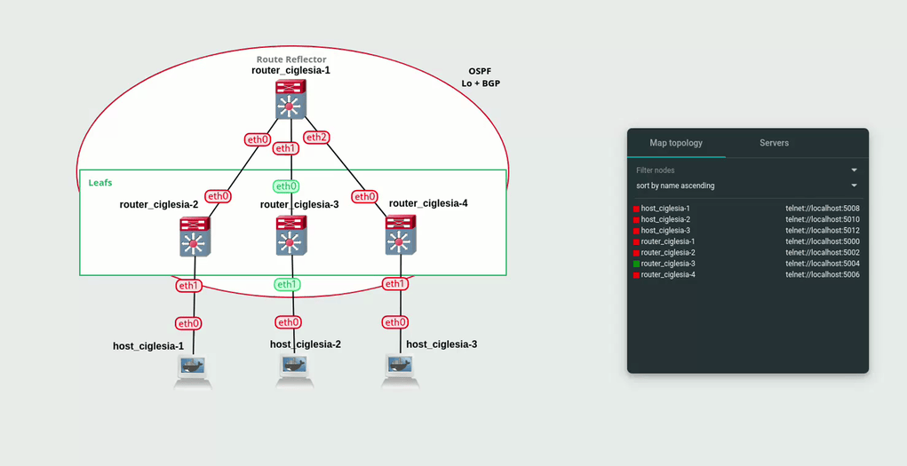

# BGP At Doors of Autonomous Systems is Simple

   
   
  
  

## Introduction

This project delves deep into networking principles, specifically focusing on VXLAN and BGP-EVPN technologies within the GNS3 platform.

## Project Overview

The project aims to showcase a deep understanding of networking concepts through practical implementation within a simulated environment. The primary goal is to deploy BGP EVPN, an extension of BGP, for efficient management of reachability information across different protocols, with a specific emphasis on EVPN for MAC address distribution.

## Technical Overview

### Virtual Machine Environment

- The project is developed within a virtual machine environment, ensuring isolation and portability across different systems.
- Virtualization technologies are utilized to create a sandboxed environment for network simulation and configuration.

### Docker Integration with GNS3

- GNS3 is configured to seamlessly integrate with Docker, leveraging containerization for network service deployment.
- Docker images are employed to emulate network devices and services, enhancing scalability and flexibility in network configuration.

### VXLAN Exploration

- VXLAN (Virtual Extensible LAN) technology is explored to establish virtualized Ethernet extensions over existing Layer 3 infrastructure.
- VXLAN is implemented within the GNS3 environment to simulate complex network topologies and study its impact on network scalability and flexibility.

### BGP with EVPN Implementation

- BGP (Border Gateway Protocol) with EVPN (Ethernet Virtual Private Network) extensions is deployed for efficient routing and MAC address distribution.
- BGP is configured to carry reachability information for various protocols, including IPv4, IPv6, and EVPN, demonstrating a comprehensive understanding of BGP's capabilities.

